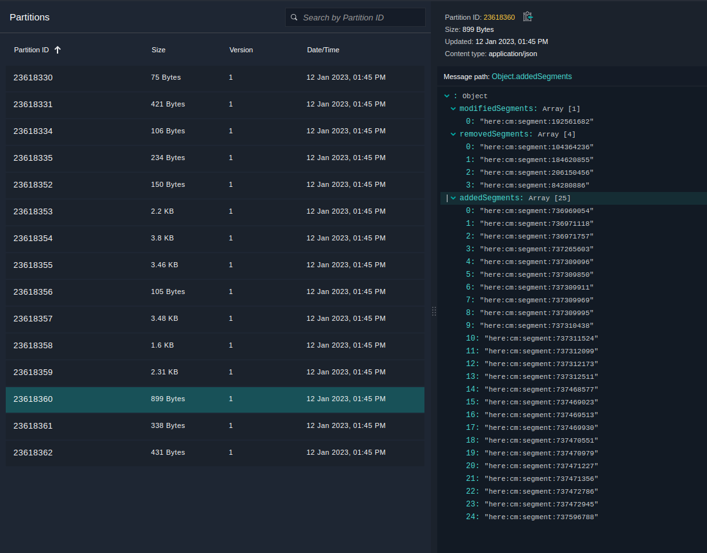

# A Compiler to Compute Catalog Differences

This Data Processing Library Java example shows how to use the
HERE Data SDK
to build a compiler pipeline that computes the difference between two versions of an input catalog
and outputs the difference is JSON format.

The `topology-geometry` layer in the HERE Map Content catalog contains, among others, road topology
segments with unique identifiers, as well as their geometry in the form of coordinate sequences.
This compiler loads two different versions of the layer and outputs a JSON document containing all
identifiers of segments that were added, removed or modified between the two versions.

The two versions accessed by the compiler are always:

1. The catalog version specified in the pipeline job configuration file. This can be, for example,
   the latest version of the catalog.
2. The catalog version specified in the pipeline job configuration _in the previous run_ of the
   compiler.

For example, if the compiler was run for the first time on version 1 of the input catalog and is
subsequently run on version 3 of the same catalog, the result of the second run is the difference
between version 1 and version 3 of the input catalog. In the first run of the compiler, since there
is no previous run, the version specified in the pipeline job configuration file is compared to an
empty catalog.

## Get Your Credentials

To run this example, you need two sets of credentials:

- **Platform credentials:** To get access to the platform data and resources, including HERE Map Content data for your pipeline input.
- **Repository credentials:** To download HERE Data SDK for Java & Scala libraries and Maven archetypes to your environment.

For more details on how to set up your credentials, see the [Identity & Access Management Developer Guide](https://developer.here.com/documentation/identity-access-management/dev_guide/index.html).

For more details on how to verify that your platform credentials are configured correctly, see the [Verify Your Credentials](https://developer.here.com/documentation/java-scala-dev/dev_guide/verify-credentials/index.html) tutorial.

## Build and Run the Compiler

In the commands that follow, replace the variable placeholders with the following values:

- `$HRN_PARTITION` is the platform environment you are in. Specify `here` unless you are
  using the HERE platform environment for China, in which case specify `here-cn`.
- `$PROJECT_HRN` is your project's `HRN` (returned by the `olp project create` command).
- `$REALM` is the ID of your organization, also called a realm. Consult your platform
  invitation letter to learn your organization ID.
- `$CATALOG_RIB` is the HRN of the public _HERE Map Content_ catalog in your pipeline configuration ([HERE environment](./config/here/local-pipeline-config.conf) or [HERE China environment](./config/here-china/local-pipeline-config.conf)).
- `$CATALOG_ID` is your output catalog's ID.
- `$CATALOG_HRN` is your output catalog's `HRN` (returned by the `olp catalog create` command).

> Note:
> We recommend that you set values to variables, so that you can easily copy and execute the following commands.

### Run the Compiler Locally

#### Create a Local HERE Map Content Differences Catalog

As mentioned above, we will use the public HERE Map Content input catalog, however, we need to create our own output catalog
to store the differences between two versions of the HERE Map Content catalog.

To run this compiler locally, use a local output catalog as described
below. For more information about local catalogs, see
[the SDK tutorial about local development and testing](https://developer.here.com/documentation/java-scala-dev/dev_guide/local-development-workflow/index.html)
and [the OLP CLI documentation](https://developer.here.com/documentation/open-location-platform-cli/user_guide/topics/local-data-workflows.html).

1. Use the [`olp local catalog create`](https://developer.here.com/documentation/open-location-platform-cli/user_guide/topics/local-data/catalog-commands.html#catalog-create)
   command to create a local catalog.

```bash
olp local catalog create difftool-java difftool-java --summary "HERE Map Content diftool example catalog" \
            --description "HERE Map Content diftool example catalog"
```

The local catalog will have the HRN `hrn:local:data:::difftool-java`.

2. Use the [`olp local catalog layer add`](https://developer.here.com/documentation/open-location-platform-cli/user_guide/topics/local-data/layer-commands.html#catalog-layer-add)
   command to add two `versioned` layers to your catalog:

| Layer ID               | Layer Type | Partitioning | Zoom Level | Content Type             | Content Encoding |
| ---------------------- | ---------- | ------------ | ---------- | ------------------------ | ---------------- |
| topology-geometry-diff | Versioned  | HEREtile     | 12         | application/json         | uncompressed     |
| state                  | Versioned  | Generic      | N.A.       | application/octet-stream | uncompressed     |

```bash
olp local catalog layer add hrn:local:data:::difftool-java topology-geometry-diff topology-geometry-diff --versioned \
            --summary "diff" --description "diff" --partitioning heretile:12 \
            --content-type application/json
olp local catalog layer add hrn:local:data:::difftool-java state state --versioned --summary "state" --description "state" \
            --partitioning Generic --content-type application/octet-stream
```

#### Build the Compiler

To build the compiler, run the following command in the [`heremapcontent-difftool`](../heremapcontent-difftool) directory:

```bash
mvn install
```

#### Run the Compiler from the Command Line

To run the compiler locally, you will need to run the entry point to the compiler:

- `com.here.platform.data.processing.example.java.difftool.processor.Main`

As arguments, you must provide the `-Dspark.master` parameter with the address of the Spark server
master to connect to, and any configuration parameters you want to override. Alternatively, you can
add those parameters to the [`application.conf`](config/here/local-application.conf) file.

Additionally, you also need to specify the `-Dpipeline-config.file` and `-Dpipeline-job.file`
parameters to specify the location of a configuration file that contains the catalogs as well as
job-specific versions of the catalogs, to read and write to.

The example project provides two template job configurations, [`config/here/pipeline-job-first.conf`](config/here/pipeline-job-first.conf) and
[`config/here/pipeline-job-second.conf`](config/here/pipeline-job-second.conf) for the first and second run of the pipeline, respectively.
If you are using the HERE platform environment in China, use the files [`config/here-china/pipeline-job-first.conf`](config/here-china/pipeline-job-first.conf)
and [`config/here-china/pipeline-job-second.conf`](config/here-china/pipeline-job-second.conf) instead.

[`pipeline-job-first.conf`](config/here/pipeline-job-first.conf) specifies in the line `version = 1` that the version 1 of the input
catalog should be processed in the first run. You can change this version to any number between 0
and the most recent version of the HERE Map Content catalog. You can find the most recent version by
opening the [HERE platform portal](https://platform.here.com/) or the
[HERE platform portal in China](https://platform.hereolp.cn/) and navigating to the `HERE Map Content` catalog, and viewing the current catalog's version in the `Catalog info` section.

[`pipeline-job-second.conf`](config/here/pipeline-job-second.conf) specifies in the line `version = 2` that version 2 of the input
catalog should be processed in the second run. You can change this version to any number that is
less than or equal to the most recent version of the HERE Map Content catalog and greater than the version
specified in [`config/here/pipeline-job-first.conf`](config/here/pipeline-job-first.conf).

For local runs, a bounding box filter is provided in the
[`config/here/local-application.conf`](config/here/local-application.conf) and [`config/here-china/local-application.conf`](config/here-china/local-application.conf) to
limit the number of partitions to be processed. This speeds up the compilation process. In this
example, we use a bounding box around the cities of Berlin and Beijing for the HERE platform and HERE
platform in China environments, respectively. You can edit the bounding box coordinates to compile a different
partition of HERE Map Content. Make sure you update the layer coverage to reflect the different
geographical region. In order to use this configuration file, you need to use the `-Dconfig.file`
parameter.

Set the environment variable `$PATH_TO_CONFIG_FOLDER` to [`./config/here`](config/here),
for the HERE platform environment in China, use the files in the [`./config/here-china`](config/here-china) directory.

The first run of the pipeline will use the job configuration [`pipeline-job-first.conf`](config/here/pipeline-job-first.conf). As
mentioned before, the first run will compute the differences between the catalog version specified
in [`pipeline-job-first.conf`](config/here/pipeline-job-first.conf) and an empty catalog. That means that all segments contained in the
input catalog will be considered as newly added segments. Run the following command line in the
[`heremapcontent-difftool`](../heremapcontent-difftool) directory to run the compiler.

For the HERE platform environment:

```bash
mvn exec:java \
-Dexec.mainClass=com.here.platform.data.processing.example.java.difftool.processor.Main \
-Dpipeline-config.file=./config/here/local-pipeline-config.conf \
-Dpipeline-job.file=./config/here/pipeline-job-first.conf \
-Dconfig.file=./config/here/local-application.conf \
-Dspark.master=local[*]
```

For the HERE platform environment for China:

```
mvn exec:java \
-Dexec.mainClass=com.here.platform.data.processing.example.java.difftool.processor.Main \
-Dpipeline-config.file=./config/here-china/local-pipeline-config.conf \
-Dpipeline-job.file=./config/here-china/pipeline-job-first.conf \
-Dconfig.file=./config/here-china/local-application.conf \
-Dspark.master=local[*]
```

In the second run, we can now compute the differences between the version used in the first run and
the version specified in [`pipeline-job-second.conf`](config/here/pipeline-job-second.conf). Run the following command line in the
[`heremapcontent-difftool`](../heremapcontent-difftool) project to run the Compiler the second time.

For the HERE platform environment:

```bash
mvn exec:java \
-Dexec.mainClass=com.here.platform.data.processing.example.java.difftool.processor.Main \
-Dpipeline-config.file=./config/here/local-pipeline-config.conf \
-Dpipeline-job.file=./config/here/pipeline-job-second.conf \
-Dconfig.file=./config/here/local-application.conf \
-Dspark.master=local[*]
```

For the HERE platform environment for China:

```
mvn exec:java \
-Dexec.mainClass=com.here.platform.data.processing.example.java.difftool.processor.Main \
-Dpipeline-config.file=./config/here-china/local-pipeline-config.conf \
-Dpipeline-job.file=./config/here-china/pipeline-job-second.conf \
-Dconfig.file=./config/here-china/local-application.conf \
-Dspark.master=local[*]
```

After the second run, in the HERE platform environment you can inspect the local catalog with the OLP CLI:

```
olp local catalog inspect hrn:local:data:::difftool-java
```

You should see partitions containing all
identifiers of segments that were added, removed or modified between the two versions of the `HERE Map Content` catalog:



The `local inspect` command is not available in the HERE platform environment for China, but you can
download partitions from the local catalog to manually inspect them.

### Run this Compiler as a HERE Platform Pipeline

#### Configure a Project

To follow this example, you will need a [project](https://developer.here.com/documentation/identity-access-management/dev_guide/topics/manage-projects.html). A project is a collection of platform resources
(catalogs, pipelines, and schemas) with controlled access. You can create a project through the
[HERE platform portal](https://platform.here.com/).

Alternatively, use the OLP CLI [`olp project create`](https://developer.here.com/documentation/open-location-platform-cli/user_guide/topics/project/project-commands.html#create-project) command to create the project:

```bash
olp project create $PROJECT_ID $PROJECT_NAME
```

The command returns the [HERE Resource Name (HRN)](https://developer.here.com/documentation/data-user-guide/user_guide/index.html) of your new project. Note down this HRN as you will need it later in this tutorial.

> #### Note
>
> You do not have to provide a `--scope` parameter if your app has a default scope.
> For details on how to set a default project scope for an app, see the _Specify a
> default Project_ for Apps chapter of the [Identity & Access Management Developer Guide](https://developer.here.com/documentation/identity-access-management/dev_guide/index.html).

For more information on how to work with projects, see the [Organize your work in projects](https://developer.here.com/documentation/java-scala-dev/dev_guide/organize-work-in-projects/index.html) tutorial.

#### Create a HERE Map Content Differences Catalog

The catalog you need to create is used to store the differences between two versions of the HERE Map
Content catalog.

1. Use the [`olp catalog create`](https://developer.here.com/documentation/open-location-platform-cli/user_guide/topics/data/catalog-commands.html#catalog-create) command to create the catalog.
   Make sure to note down the HRN returned by the following command for later use:

```bash
olp catalog create $CATALOG_ID $CATALOG_ID --summary "HERE Map Content diftool example catalog" \
            --description "HERE Map Content diftool example catalog" \
            --scope $PROJECT_HRN
```

2. Use the [`olp catalog layer add`](https://developer.here.com/documentation/open-location-platform-cli/user_guide/topics/data/layer-commands.html#catalog-layer-add) command to add two `versioned` layers to your catalog:

```bash
olp catalog layer add $CATALOG_HRN topology-geometry-diff topology-geometry-diff --versioned \
            --summary "diff" --description "diff" --partitioning heretile:12 \
            --content-type application/json --scope $PROJECT_HRN
olp catalog layer add $CATALOG_HRN state state --versioned --summary "state" --description "state" \
            --partitioning Generic --content-type application/octet-stream \
            --scope $PROJECT_HRN
```

> #### Note::
>
> If a billing tag is required in your realm, use the `--billing-tags: "YOUR_BILLING_TAG"` parameter.

3. Use the [`olp project resource link`](https://developer.here.com/documentation/open-location-platform-cli/user_guide/topics/project/project-link-commands.html#project-resource-link) command to link the _HERE Map Content_ catalog to your project:

```bash
olp project resource link $PROJECT_HRN $CATALOG_RIB
```

- For more details on catalog commands, see [Catalog Commands](https://developer.here.com/documentation/open-location-platform-cli/user_guide/topics/data/catalog-commands.html).
- For more details on layer commands, see [Layer Commands](https://developer.here.com/documentation/open-location-platform-cli/user_guide/topics/data/layer-commands.html).
- For more details on project commands, see [Project Commands](https://developer.here.com/documentation/open-location-platform-cli/user_guide/topics/project/project-commands.html).
- For instructions on how to link a resource to a project, see [Project Resource Link command](https://developer.here.com/documentation/open-location-platform-cli/user_guide/topics/project/project-link-commands.html#project-resource-link).

#### Configure the Compiler

From the SDK examples directory, open the `data-processing/java/heremapcontent-difftool` project in your
Integrated Development Environment (IDE).

The `config/here/pipeline-config.conf` (for the HERE platform environment) and
`config/here-china/pipeline-config.conf` (for the HERE platform environment in China) files contain
the permanent configuration of the data sources for the compiler.

Pick the file that corresponds to your platform environment. For example, the pipeline configuration for
the HERE platform environment looks like:

```javascript
pipeline.config {
  output-catalog {hrn = "YOUR_OUTPUT_CATALOG_HRN"}
  input-catalogs {
    rib {hrn = "hrn:here:data::olp-here:rib-2"}
  }
}
```

Replace `YOUR_OUTPUT_CATALOG_HRN` with the HRN of your HERE Map Content differences
catalog created above.

#### Pipeline Job Configuration

The pipeline job configuration file defines on which version of the input catalog to run the
compiler on.

The example project provides two template job configurations, `config/here/pipeline-job-first.conf` and
`config/here/pipeline-job-second.conf` for the first and second run of the pipeline, respectively.
If you are using the HERE platform environment in China, use the files `config/here-chine/pipeline-job-first.conf`
and `config/here-china/pipeline-job-second.conf` instead.

`pipeline-job-first.conf` specifies in the line `version = 1` that the version 1 of the input
catalog should be processed in the first run. You can change this version to any number between 0
and the most recent version of the HERE Map Content catalog. You can find the most recent version by
opening the [HERE platform portal](https://platform.here.com/) or the
[HERE platform portal in China](https://platform.hereolp.cn/) and navigating to the HERE Map Content catalog, and viewing the current catalog's version in the Catalog info section.

`pipeline-job-second.conf` specifies in the line `version = 2` that version 2 of the input
catalog should be processed in the second run. You can change this version to any number that is
less or equal the most recent version of the HERE Map Content catalog and greater than the version
specified in `pipeline-job-first.conf`.

The remainder of the configuration is specified in the `application.conf` file that can be found in the
`src/main/resources` directory of the compiler project. However, you do not have to modify it unless you
want to change the behavior of the compiler.

#### Generate a Fat JAR file

Run the `mvn -Pplatform package` command in the `heremapcontent-difftool` directory to generate a
fat JAR file to deploy the compiler to a Pipeline.

```bash
mvn -Pplatform package
```

#### Deploy the Compiler to a Pipeline

Once the previous command is finished, your JAR is then available at the `target` directory, and you
can upload it using the [HERE pipeline UI](https://platform.here.com/pipelines) (the
[HERE China pipeline UI](https://platform.hereolp.cn/pipelines) in China)
or the [OLP CLI](https://developer.here.com/documentation/open-location-platform-cli).

You can use the OLP CLI to create pipeline components and activate the pipeline version with the following commands:

1. [Create](https://developer.here.com/documentation/open-location-platform-cli/user_guide/topics/pipeline-workflows.html) pipeline components:

For this example, a bounding box filter is provided by `--runtime-config` parameter to
limit the number of partitions to be processed. This speeds up the compilation process. In this
example, we use a bounding box around the cities of Berlin and Beijing for the HERE platform and HERE
platform in China environments respectively. You can edit the bounding box coordinates to compile a different
partition of HERE Map Content. Make sure you update the layer coverage to reflect the different
geographical region.

```bash
olp pipeline create $COMPONENT_NAME_Pipeline --scope $PROJECT_HRN
olp pipeline template create $COMPONENT_NAME_Template batch-3.0 $PATH_TO_JAR \
                com.here.platform.data.processing.example.java.difftool.processor.Main \
                --workers=4 --worker-units=3 --supervisor-units=2 --input-catalog-ids=rib \
                --scope $PROJECT_HRN
olp pipeline version create $COMPONENT_NAME_version $PIPELINE_ID $PIPELINE_TEMPLATE_ID \
                "$PATH_TO_CONFIG_FOLDER/pipeline-config.conf" \
                --runtime-config  here.platform.data-processing.executors.partitionKeyFilters.0.className=BoundingBoxFilter \
                                  here.platform.data-processing.executors.partitionKeyFilters.0.param.boundingBox.north=52.67551 \
                                  here.platform.data-processing.executors.partitionKeyFilters.0.param.boundingBox.south=52.338261 \
                                  here.platform.data-processing.executors.partitionKeyFilters.0.param.boundingBox.east=13.76116 \
                                  here.platform.data-processing.executors.partitionKeyFilters.0.param.boundingBox.west=13.08835 \
                --scope $PROJECT_HRN
```

2. [Activate](https://developer.here.com/documentation/open-location-platform-cli/user_guide/topics/pipeline/version-commands.html#pipeline-version-activate) the pipeline version:

```bash
olp pipeline version activate $PIPELINE_ID $PIPELINE_VERSION_ID \
                --input-catalogs "$PATH_TO_CONFIG_FOLDER/pipeline-job-first.conf" \
                --scope $PROJECT_HRN
```

3. Wait for the first job to finish and start the second run with the different version of input catalog:

```bash
olp pipeline version activate $PIPELINE_ID $PIPELINE_VERSION_ID \
                --input-catalogs "$PATH_TO_CONFIG_FOLDER/pipeline-job-second.conf" \
                --scope $PROJECT_HRN
```

In the [HERE platform portal](https://platform.here.com/pipelines) / [HERE platform portal in China](https://platform.hereolp.cn/pipelines),
navigate to your pipeline to see its status.

## Verify the Output

In the [HERE platform portal](https://platform.here.com/) / [HERE platform portal in China](https://platform.hereolp.cn/),
select the **Data** tab and find your catalog.

1. Open the `topology-geometry-diff` layer and select the **Inspect** tab.
2. On the map, navigate to the location of your bounding box and set the zoom to level 10.
3. Finally, select any highlighted partition to view the results. The JSON output of the compiler
   should be displayed on the right side.

The results should be visible on the map.


