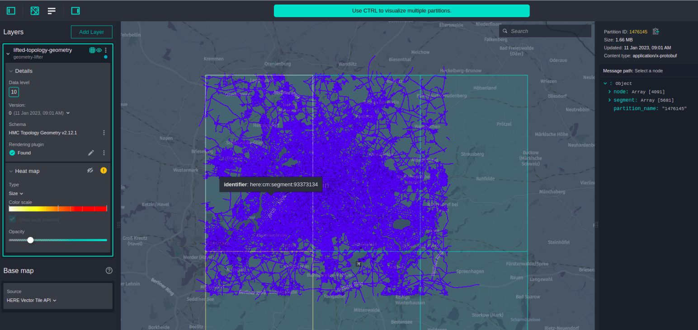

# A Compiler to lift road topology and geometry and aggregate it to higher level

This Data Processing Library Scala example shows how to use the HERE
Data SDK to build a compiler pipeline that elevates and aggregates data to a higher level.

In this example, the [`DirectMToNCompiler`](https://developer.here.com/documentation/data-processing-library/dev_guide/topics/functional-patterns.html#direct-1n-and-mn-compilers) functional pattern is used,
since this pattern covers use cases when we need to do geometric transformations, such as processing neighboring tiles or merging and splitting tiles.

The compiler that we are going to develop is designed to take HERE Map Content input data, merge the incoming lower level tiles into a single tile,
and produce output tiles at a higher HEREtile level. The output of this compiler is written
to `lifted-topology-geometry` layer in the same Protobuf format with HEREtile partitioning
on a higher level.

For more information about the `DirectMToNCompiler` functional pattern, see the [`Data Processing Library Developer Guide`](https://developer.here.com/documentation/data-processing-library/dev_guide/topics/functional-patterns.html#direct-1n-and-mn-compilers).

## Get Your Credentials

To run this example, you need two sets of credentials:

- **Platform credentials:** To get access to the platform data and resources, including HERE Map Content data for your pipeline input.
- **Repository credentials:** To download HERE Data SDK for Java & Scala libraries and Maven archetypes to your environment.

For more details on how to set up your credentials, see the [Identity & Access Management Developer Guide](https://developer.here.com/documentation/identity-access-management/dev_guide/index.html).

For more details on how to verify that your platform credentials are configured correctly, see the [Verify Your Credentials](https://developer.here.com/documentation/java-scala-dev/dev_guide/verify-credentials/index.html) tutorial.

## Build and Run the Compiler

In the commands that follow, replace the variable placeholders with the following values:

- `$CATALOG_ID` is your output catalog's ID.
- `$CATALOG_HRN` is your output catalog's `HRN` (returned by the `olp catalog create` command).
- `$HRN_PARTITION` is the platform environment you are in. The value should be `here`.
- `$REALM` is the ID of your organization, also called a realm. Consult your platform
  invitation letter to learn your organization ID.
- `$CATALOG_RIB` is the HRN of the public _HERE Map Content_ catalog in your pipeline configuration ([HERE environment](./config/here/pipeline-config.conf).
- `$OLP_EMAIL` is a single contact e-mail address for the pipeline.

> Note:
> We recommend that you set values to variables, so that you can easily copy and execute the following commands.

### Run the Compiler Locally

#### Create a Local Geometry Lifter Catalog

As mentioned above, we will use the public HERE Map Content input catalog, however, we need to create our own output catalog to store the lifted geometry that the compiler generates.

To run this compiler locally, use a local output catalog as described
below. If you want to know more about local catalogs, see
[the SDK tutorial about local development and testing](https://developer.here.com/documentation/java-scala-dev/dev_guide/local-development-workflow/index.html)
and [the OLP CLI documentation](https://developer.here.com/documentation/open-location-platform-cli/user_guide/topics/local-data-workflows.html).

1. Use the [`olp local catalog create`](https://developer.here.com/documentation/open-location-platform-cli/user_guide/topics/local-data/catalog-commands.html#catalog-create)
   command to create a local catalog.

```bash
olp local catalog create geometry-lifter-scala geometry-lifter-scala --summary "Geometry lifter example catalog" \
            --description "Geometry lifter example catalog"
```

The local catalog will have the HRN `hrn:local:data:::geometry-lifter-scala`.

2. Use the [`olp local catalog layer add`](https://developer.here.com/documentation/open-location-platform-cli/user_guide/topics/local-data/layer-commands.html#catalog-layer-add)
   command to add two `versioned` layers to your catalog:

| Layer ID                 | Layer Type | Partitioning | Zoom Level | Content Type             | Content Encoding | Schema                  |
| ------------------------ | ---------- | ------------ | ---------- | ------------------------ | ---------------- | ----------------------- |
| lifted-topology-geometry | Versioned  | HEREtile     | 10         | application/x-protobuf   | uncompressed     | RIB 2 Topology Geometry |
| state                    | Versioned  | Generic      | N.A.       | application/octet-stream | uncompressed     | -                       |

```bash
olp local catalog layer add hrn:local:data:::geometry-lifter-scala lifted-topology-geometry lifted-topology-geometry --versioned --summary "lifted topology-geometry" \
            --description "lifted topology-geometry"  --partitioning heretile:10 \
            --content-type application/x-protobuf \
            --schema hrn:$HRN_PARTITION:schema::$REALM:com.here.schema.rib:topology-geometry_v2:2.12.1
olp local catalog layer add hrn:local:data:::geometry-lifter-scala state state --versioned --summary "state" \
            --description "state" --partitioning Generic \
            --content-type application/octet-stream
```

#### Run the Compiler from the Command Line

To run the compiler locally, you will need to run the entry point to the compiler:

- `com.here.platform.data.processing.example.scala.geometry.lifter.Main`

As arguments, you must provide the `-Dspark.master` parameter with the address of the Spark server
master to connect to, and any configuration parameters you want to override. Alternatively, you
can add those parameters to the [`application.conf`](config/here/local-application.conf) file.

Additionally, you also need to specify the `-Dpipeline-config.file` and `-Dpipeline-job.file` parameters
to define the location of a configuration file that contains the catalogs as well as job-specific versions
of the catalogs, to read and write to.

For local runs, a bounding box filter is provided in the
[`config/here/local-application.conf`](config/here/local-application.conf) to
limit the number of partitions to be processed. This speeds up the compilation process. In this
example, we use a bounding box around the cities of Berlin. You can edit the bounding box coordinates to compile a different
partition of HERE Map Content. Make sure you update the layer coverage to reflect the different
geographical region. In order to use this configuration file, you need to use the `-Dconfig.file`
parameter.

Set the environment variable `$PATH_TO_CONFIG_FOLDER` to [`./config/here`](config/here),
for the HERE platform environment.

The [`.jvmopts`](.jvmopts) file contains `--add-opens` options required to run Spark applications with Java 17.

Use all the above settings to run the following command in the [`geometry-lifter`](../geometry-lifter)
directory to run the Geometry Lifter Compiler.

For the HERE platform environment:

```bash
sbt run \
-Dpipeline-config.file=./config/here/local-pipeline-config.conf \
-Dpipeline-job.file=./config/here/pipeline-job.conf \
-Dconfig.file=./config/here/local-application.conf \
-Dspark.master=local[*]
```

After one run, in the HERE platform environment, you can inspect the local catalog with the OLP CLI:

```
olp local catalog inspect hrn:local:data:::geometry-lifter-scala
```

You should see the following result:



### Run this Compiler as a HERE Platform Pipeline

#### Configure a Project

To follow this example, you will need a [project](https://developer.here.com/documentation/identity-access-management/dev_guide/topics/manage-projects.html). A project is a collection of platform resources
(catalogs, pipelines, and schemas) with controlled access. You can create a project through the
[HERE platform portal](https://platform.here.com/).

Alternatively, use the OLP CLI [`olp project create`](https://developer.here.com/documentation/open-location-platform-cli/user_guide/topics/project/project-commands.html#create-project) command to create the project:

```bash
olp project create $PROJECT_ID $PROJECT_NAME
```

The command returns the [HERE Resource Name (HRN)](https://developer.here.com/documentation/data-user-guide/user_guide/index.html) of your new project. Note down this HRN as you will need it later in this tutorial.

> #### Note
>
> You do not have to provide a `--scope` parameter if your app has a default scope.
> For details on how to set a default project scope for an app, see the _Specify a
> default Project_ for Apps chapter of the [Identity & Access Management Developer Guide](https://developer.here.com/documentation/identity-access-management/dev_guide/index.html).

For more information on how to work with projects, see the [Organize your work in projects](https://developer.here.com/documentation/java-scala-dev/dev_guide/organize-work-in-projects/index.html) tutorial.

#### Create a Catalog

The catalog you need to create is used to store the lifted geometry that the compiler generates.

1. Use the [`olp catalog create`](https://developer.here.com/documentation/open-location-platform-cli/user_guide/topics/data/catalog-commands.html#catalog-create) command to create the catalog.
   Make sure to note down the HRN returned by the following command for later use:

```bash
olp catalog create $CATALOG_ID $CATALOG_ID --summary "Geometry lifter example catalog" \
            --description "Geometry lifter example catalog" \
            --scope $PROJECT_HRN
```

2. Use the [`olp catalog layer add`](https://developer.here.com/documentation/open-location-platform-cli/user_guide/topics/data/layer-commands.html#catalog-layer-add) command to add two `versioned` layers to your catalog:

```bash
olp catalog layer add $CATALOG_HRN lifted-topology-geometry lifted-topology-geometry --versioned --summary "lifted topology-geometry" \
            --description "lifted topology-geometry"  --partitioning heretile:10 \
            --content-type application/x-protobuf \
            --schema hrn:$HRN_PARTITION:schema::$REALM:com.here.schema.rib:topology-geometry_v2:2.12.1 \
            --scope $PROJECT_HRN
olp catalog layer add $CATALOG_HRN state state --versioned --summary "state" \
            --description "state" --partitioning Generic \
            --content-type application/octet-stream  --scope $PROJECT_HRN
```

> #### Note::
>
> If a billing tag is required in your realm, use the `--billing-tags: "YOUR_BILLING_TAG"` parameter.

3. Use the [`olp project resource link`](https://developer.here.com/documentation/open-location-platform-cli/user_guide/topics/project/project-link-commands.html#project-resource-link) command to link the _HERE Map Content_ catalog to your project:

```bash
olp project resource link $PROJECT_HRN $CATALOG_RIB
```

- For more details on catalog commands, see [Catalog Commands](https://developer.here.com/documentation/open-location-platform-cli/user_guide/topics/data/catalog-commands.html).
- For more details on layer commands, see [Layer Commands](https://developer.here.com/documentation/open-location-platform-cli/user_guide/topics/data/layer-commands.html).
- For more details on project commands, see [Project Commands](https://developer.here.com/documentation/open-location-platform-cli/user_guide/topics/project/project-commands.html).
- For instructions on how to link a resource to a project, see [Project Resource Link command](https://developer.here.com/documentation/open-location-platform-cli/user_guide/topics/project/project-link-commands.html#project-resource-link).

#### Configure the Compiler

From the SDK examples directory, open the `data-processing/scala/geometry-lifter` project in your
Integrated Development Environment (IDE).

The `compiler/config/here/pipeline-config.conf` file contains
the permanent configuration of the data sources for the compiler.

Pick the file that corresponds to your platform environment. For example, the pipeline configuration for
the HERE platform environment looks like:

```javascript
pipeline.config {
  output-catalog {hrn = "YOUR_OUTPUT_CATALOG_HRN"}
  input-catalogs {
    rib {hrn = "hrn:here:data::olp-here:rib-2"}
  }
}
```

Replace `YOUR_OUTPUT_CATALOG_HRN` with the HRN of your lifted geometry catalog.
To find the HRN, in the [HERE platform portal](https://platform.here.com/),
navigate to your catalog. The HRN is displayed in the upper
left corner of the page.

The `config/here/pipeline-job.conf` file contains the compiler's run configuration.

In this file, modify `version = 1` to reflect the version of the HERE Map Content catalog you want
to process. To find the version of the HERE Map Content catalog, in the
[HERE platform](https://platform.here.com/),
navigate to the HERE Map Content catalog, and view the current catalog's version in the Catalog info section.

The remainder of the configuration is specified in the `application.conf` file that can be found in the
`src/main/resources` directory of the compiler project. However, you do not have to modify it unless
you want to change the behavior of the compiler.

#### Generate a Fat JAR file

Run the `sbt assembly` command in the `geometry-lifter`
directory to generate a fat JAR file.

```bash
sbt assembly
```

#### Deploy the Compiler to a Pipeline

Once the previous command is finished, your JAR is then available at the `target` directory, and you
can upload it using the [HERE pipelines UI](https://platform.here.com/pipelines)
or the [OLP CLI](https://developer.here.com/documentation/open-location-platform-cli).

You can use the OLP CLI to create pipeline components and activate the pipeline version with the following commands:

1. [Create](https://developer.here.com/documentation/open-location-platform-cli/user_guide/topics/pipeline-workflows.html) pipeline components:

For this example, a bounding box filter is provided by `--runtime-config` parameter to
limit the number of partitions to be processed. This speeds up the compilation process. In this
example, we use a bounding box around the cities of Berlin.
You can edit the bounding box coordinates to compile a different
partition of HERE Map Content. Make sure you update the layer coverage to reflect the different
geographical region.

```bash
olp pipeline create $COMPONENT_NAME_Pipeline --email $OLP_EMAIL --scope $PROJECT_HRN
olp pipeline template create $COMPONENT_NAME_Template batch-4.1 $PATH_TO_JAR \
                com.here.platform.data.processing.example.scala.geometry.lifter.Main \
                --workers=4 --worker-units=3 --supervisor-units=2 --input-catalog-ids=rib \
                --scope $PROJECT_HRN
olp pipeline version create $COMPONENT_NAME_version $PIPELINE_ID $PIPELINE_TEMPLATE_ID \
                "$PATH_TO_CONFIG_FOLDER/pipeline-config.conf" \
                --runtime-config  here.platform.data-processing.executors.partitionKeyFilters.0.className=BoundingBoxFilter \
                                  here.platform.data-processing.executors.partitionKeyFilters.0.param.boundingBox.north=52.67551 \
                                  here.platform.data-processing.executors.partitionKeyFilters.0.param.boundingBox.south=52.338261 \
                                  here.platform.data-processing.executors.partitionKeyFilters.0.param.boundingBox.east=13.76116 \
                                  here.platform.data-processing.executors.partitionKeyFilters.0.param.boundingBox.west=13.08835 \
                --scope $PROJECT_HRN
```

2. [Activate](https://developer.here.com/documentation/open-location-platform-cli/user_guide/topics/pipeline/version-commands.html#pipeline-version-activate) the pipeline version:

```bash
olp pipeline version activate $PIPELINE_ID $PIPELINE_VERSION_ID \
                --input-catalogs "$PATH_TO_CONFIG_FOLDER/pipeline-job.conf" \
                --scope $PROJECT_HRN
```

You do not have to specify the input catalog's version, unless you want
to. The latest version will be automatically used.

In the [HERE platform portal](https://platform.here.com/pipelines),
navigate to your pipeline to see its status.

## Verify the Output

In the [HERE platform portal](https://platform.here.com/),
select the **Data** tab and find your catalog.

1. Open the `lifted-topology-geometry` layer and select the **Inspect** tab.
2. On the map, navigate to the location of your bounding box and set the zoom to level 10.
3. Finally, select any highlighted partition to view the results displayed on the map.

The results should be visible on the map.


