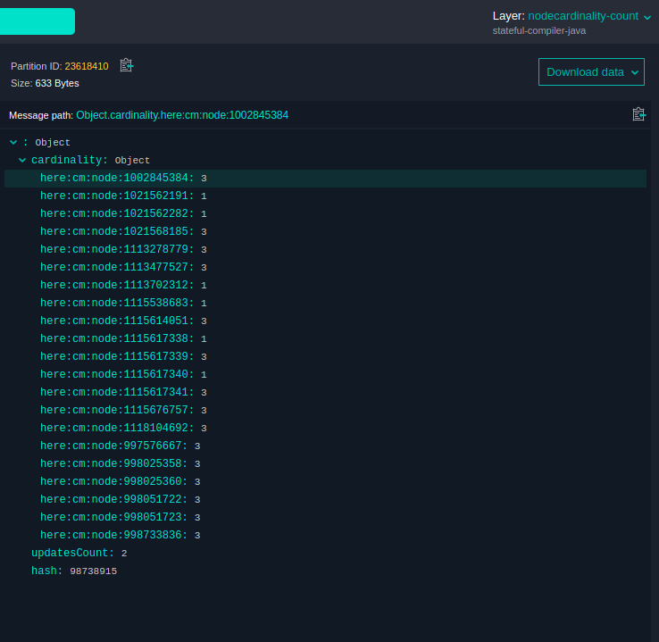

# A Stateful Processing Compiler to Process Input and Feedback Data

This Data Processing Library Scala example shows how to build a
[stateful processing compiler](https://developer.here.com/documentation/data-processing-library/content/dev_guide/topics/stateful-processing.html)
that extracts the cardinality of nodes in the "Road Topology & Geometry" layer of HERE Map Content catalog
and how to use the output of the previous compilation as feedback input to count the number of times
the node cardinalities changed for each partition.

The node cardinality refers to the number of segment references for every topology node.
In this example we use the
[Road Topology and Geometry Layer](https://developer.here.com/documentation/here-map-content/topics/topology-layer.html)
that consists of
[Topology Geometry Partitions](https://developer.here.com/documentation/here-map-content/topics_api/com.here.schema.rib.v2.topologygeometrypartition.html)
where each
[Partition](https://developer.here.com/documentation/data-store/data_dev_guide/shared_content/topics/location_platform_data_store/partitions.html#partitions)
contains a set of
[Nodes](https://developer.here.com/documentation/here-map-content/topics_api/com.here.schema.rib.v2.node.html#com.here.schema.rib.v2.node)
.

In this example, the [`DirectMToNCompiler`](https://developer.here.com/documentation/data-processing-library/dev_guide/topics/functional-patterns.html#direct-1n-and-mn-compilers) functional pattern is used,
since it allows to implement transformation partitions.

The compiler runs twice with different HERE Map Content catalog versions and does the following:

- takes HERE Map Content input data as well as data from a previous compilation as feedback
- finds the cardinality for each node in a partition
- if the input data has changed since the last compilation, the compiler
  updates the cardinality and increments the variable that counts the number of times the compiler has
  run

For more information about the `DirectMToNCompiler` functional pattern, see the [`Data Processing Library Developer Guide`](https://developer.here.com/documentation/data-processing-library/dev_guide/topics/functional-patterns.html#direct-1n-and-mn-compilers).

## Get Your Credentials

To run this example, you need two sets of credentials:

- **Platform credentials:** To get access to the platform data and resources, including HERE Map Content data for your pipeline input.
- **Repository credentials:** To download HERE Data SDK for Java & Scala libraries and Maven archetypes to your environment.

For more details on how to set up your credentials, see the [Identity & Access Management Developer Guide](https://developer.here.com/documentation/identity-access-management/dev_guide/index.html).

For more details on how to verify that your platform credentials are configured correctly, see the [Verify Your Credentials](https://developer.here.com/documentation/java-scala-dev/dev_guide/verify-credentials/index.html) tutorial.

## Build and Run the Compiler

In the commands that follow, replace the variable placeholders with the following values:

- `$CATALOG_ID` is your output catalog's ID.
- `$CATALOG_HRN` is your output catalog's `HRN` (returned by the `olp catalog create` command).
- `$PROJECT_HRN` is your project's `HRN` (returned by the `olp project create` command).
- `$CATALOG_RIB` is the HRN of the public _HERE Map Content_ catalog in your pipeline configuration ([HERE environment](./config/here/pipeline-config.conf) or [HERE environment in China](./config/here-china/pipeline-config.conf)).

> Note:
> We recommend that you set values to variables, so that you can easily copy and execute the following commands.

### Run the Compiler Locally

#### Create a Local Stateful Processing Compiler Catalog

The catalog you create is used to store the cardinality of nodes and the number of times the
compiler has run.

To run this compiler locally, use a local output catalog as described
below. For more information about local catalogs, see
[the SDK tutorial about local development and testing](https://developer.here.com/documentation/java-scala-dev/dev_guide/local-development-workflow/index.html)
and [the OLP CLI documentation](https://developer.here.com/documentation/open-location-platform-cli/user_guide/topics/local-data-workflows.html).

1. Use the [`olp local catalog create`](https://developer.here.com/documentation/open-location-platform-cli/user_guide/topics/local-data/catalog-commands.html#catalog-create)
   command to create the local catalog.

```bash
olp local catalog create stateful-compiler-scala stateful-compiler-scala --summary "Stateful compiler example catalog" \
            --description "Stateful compiler example catalog"
```

The local catalog will have the HRN `hrn:local:data:::stateful-compiler-scala`.

2. Use the [`olp local catalog layer add`](https://developer.here.com/documentation/open-location-platform-cli/user_guide/topics/local-data/layer-commands.html#catalog-layer-add)
   command to add two `versioned` layers to your catalog:

| Layer ID              | Partitioning | Zoom Level | Layer Type | Content Type             | Schema | Content Encoding |
| --------------------- | ------------ | ---------- | ---------- | ------------------------ | ------ | ---------------- |
| nodecardinality-count | HEREtile     | 12         | Versioned  | application/json         | None   | uncompressed     |
| state                 | Generic      | N.A.       | Versioned  | application/octet-stream | None   | uncompressed     |

```bash
olp local catalog layer add hrn:local:data:::stateful-compiler-scala nodecardinality-count nodecardinality-count --versioned --summary "nodecardinality count" \
            --description "nodecardinality count" --partitioning heretile:12 \
            --content-type application/json
olp local catalog layer add hrn:local:data:::stateful-compiler-scala state state --versioned --summary "state" --description "state" \
            --partitioning Generic --content-type application/octet-stream
```

#### Build the Compiler

To build the compiler, run `mvn install` in the `stateful-nodecardinality-extraction` directory.

```bash
mvn install
```

#### Run the Compiler from the Command Line

To run the compiler locally, you will need to run the entry point to the compiler:

- `com.here.platform.data.processing.example.scala.feedback.Main`

As arguments, you must provide the `-Dspark.master` parameter with the address of the Spark server
master to connect to, and any configuration parameters you want to override. Alternatively, you can
add those parameters to the [`application.conf`](config/here/local-application.conf) file.

Additionally, you also need to specify the `-Dpipeline-config.file` and `-Dpipeline-job.file`
parameters to define the location of a configuration file that contains the catalogs as well as
job-specific versions of the catalogs, to read and write to.

The example project provides two template job configurations, [`config/here/pipeline-job-first.conf`](config/here/pipeline-job-first.conf) and
[`config/here/pipeline-job-second.conf`](config/here/pipeline-job-second.conf) for the first and second run of the pipeline, respectively.
If you are using the HERE platform environment in China, use the files [`config/here-china/pipeline-job-first.conf`](config/here-china/pipeline-job-first.conf)
and [`config/here-china/pipeline-job-second.conf`](config/here-china/pipeline-job-second.conf) instead.

[`pipeline-job-first.conf`](config/here/pipeline-job-first.conf) specifies in the line `version = 1` that the version 1 of the input
catalog should be processed in the first run. You can change this version to any number between 0
and the most recent version of the HERE Map Content catalog. You can find the most recent version by
opening the [HERE platform portal](https://platform.here.com/) or the
[HERE platform portal in China](https://platform.hereolp.cn/) and navigating to the `HERE Map Content` catalog, and viewing the current catalog's version in the `Catalog info` section.

[`pipeline-job-second.conf`](config/here/pipeline-job-second.conf) specifies in the line `version = 2` that version 2 of the input
catalog should be processed in the second run. You can change this version to any number that is
less than or equal to the most recent version of the HERE Map Content catalog and greater than the version
specified in [`config/here/pipeline-job-first.conf`](config/here/pipeline-job-first.conf).

For local runs, a bounding box filter is provided in the
[`config/here/local-application.conf`](config/here/local-application.conf) and [`config/here-china/local-application.conf`](config/here-china/local-application.conf) to
limit the number of partitions to be processed. This speeds up the compilation process. In this
example, we use a bounding box around the cities of Berlin and Beijing for the HERE platform and HERE
platform in China environments, respectively. You can edit the bounding box coordinates to compile a different
partition of HERE Map Content. Make sure you update the layer coverage to reflect the different
geographical region. In order to use this configuration file, you need to use the `-Dconfig.file`
parameter.

Set the environment variable `$PATH_TO_CONFIG_FOLDER` to [`./config/here`](config/here),
for the HERE platform environment in China, use the files in the [`./config/here-china`](config/here-china) directory.

Finally, execute the following command in the
[`stateful-nodecardinality-extraction`](../stateful-nodecardinality-extraction) directory to run The Stateful Processing Compiler.

For the HERE platform environment:

```bash
mvn exec:java \
-Dexec.mainClass=com.here.platform.data.processing.example.scala.feedback.Main \
-Dpipeline-config.file=./config/here/local-pipeline-config.conf \
-Dpipeline-job.file=./config/here/pipeline-job-first.conf \
-Dconfig.file=./config/here/local-application.conf \
-Dspark.master=local[*]
```

For the HERE platform environment for China:

```
mvn exec:java \
-Dexec.mainClass=com.here.platform.data.processing.example.scala.feedback.Main \
-Dpipeline-config.file=./config/china-here/local-pipeline-config.conf \
-Dpipeline-job.file=./config/china-here/pipeline-job-first.conf \
-Dconfig.file=./config/china-here/local-application.conf \
-Dspark.master=local[*]
```

To observe the behavior of the Stateful Processing Compiler, you have to run the compiler again using
[`pipeline-job-second.conf`](config/here/pipeline-job-second.conf) as job configuration:

For the HERE platform environment:

```bash
mvn exec:java \
-Dexec.mainClass=com.here.platform.data.processing.example.scala.feedback.Main \
-Dpipeline-config.file=./config/here/local-pipeline-config.conf \
-Dpipeline-job.file=./config/here/pipeline-job-second.conf \
-Dconfig.file=./config/here/local-application.conf \
-Dspark.master=local[*]
```

For the HERE platform environment for China:

```
mvn exec:java \
-Dexec.mainClass=com.here.platform.data.processing.example.scala.feedback.Main \
-Dpipeline-config.file=./config/china-here/local-pipeline-config.conf \
-Dpipeline-job.file=./config/china-here/pipeline-job-second.conf \
-Dconfig.file=./config/china-here/local-application.conf \
-Dspark.master=local[*]
```

After the second run, in the HERE platform environment, you can inspect the local catalog with the OLP CLI:

```
olp local catalog inspect hrn:local:data:::stateful-compiler-scala
```

You should see the nodes with their cardinality, for example `here:cm:node:1002845384: 3`, where `here:cm:node:1002845384` is the node, and `3` - cardinality.
The field `updatesCount` will be `1` for those partitions that did not change during the second run, otherwise it will be `2`.



The `local inspect` command is not available in the HERE platform environment for China, but you can
download partitions from the local catalog to inspect them manually.

### Run this Compiler as a HERE Platform Pipeline

#### Configure a Project

To follow this example, you will need a [project](https://developer.here.com/documentation/identity-access-management/dev_guide/topics/manage-projects.html). A project is a collection of platform resources
(catalogs, pipelines, and schemas) with controlled access. You can create a project through the
[HERE platform portal](https://platform.here.com/) / [HERE platform portal in China](https://platform.hereolp.cn/).

Alternatively, use the OLP CLI [`olp project create`](https://developer.here.com/documentation/open-location-platform-cli/user_guide/topics/project/project-commands.html#create-project) command to create the project:

```bash
olp project create $PROJECT_ID $PROJECT_NAME
```

The command returns the [HERE Resource Name (HRN)](https://developer.here.com/documentation/data-user-guide/user_guide/index.html) of your new project. Note down this HRN as you will need it later in this tutorial.

> #### Note
>
> You do not have to provide a `--scope` parameter if your app has a default scope.
> For details on how to set a default project scope for an app, see the _Specify a
> default Project_ for Apps chapter of the [Identity & Access Management Developer Guide](https://developer.here.com/documentation/identity-access-management/dev_guide/index.html).

For more information on how to work with projects, see the [Organize your work in projects](https://developer.here.com/documentation/java-scala-dev/dev_guide/organize-work-in-projects/index.html) tutorial.

#### Create a Stateful Processing Compiler Catalog

As mentioned above, we will use the public HERE Map Content input catalog, however, we need to create our own output catalog
to store the cardinality of nodes and the number of times the compiler has run.

1. Use the [`olp catalog create`](https://developer.here.com/documentation/open-location-platform-cli/user_guide/topics/data/catalog-commands.html#catalog-create) command to create the catalog.
   Make sure to note down the HRN returned by the following command for later use:

```bash
olp catalog create $CATALOG_ID $CATALOG_ID --summary "Stateful compiler example catalog" \
            --description "Stateful compiler example catalog" \
            --scope $PROJECT_HRN
```

2. Use the [`olp catalog layer add`](https://developer.here.com/documentation/open-location-platform-cli/user_guide/topics/data/layer-commands.html#catalog-layer-add) command to add two `versioned` layers to your catalog:

```bash
olp catalog layer add $CATALOG_HRN nodecardinality-count nodecardinality-count --versioned --summary "nodecardinality count" \
            --description "nodecardinality count" --partitioning heretile:12 \
            --content-type application/json --scope $PROJECT_HRN
olp catalog layer add $CATALOG_HRN state state --versioned --summary "state" --description "state" \
            --partitioning Generic --content-type application/octet-stream \
            --scope $PROJECT_HRN
```

> #### Note::
>
> If a billing tag is required in your realm, use the `--billing-tags: "YOUR_BILLING_TAG"` parameter.

3. Use the [`olp project resource link`](https://developer.here.com/documentation/open-location-platform-cli/user_guide/topics/project/project-link-commands.html#project-resource-link) command to link the _HERE Map Content_ catalog to your project:

```bash
olp project resource link $PROJECT_HRN $CATALOG_RIB
```

- For more details on catalog commands, see [Catalog Commands](https://developer.here.com/documentation/open-location-platform-cli/user_guide/topics/data/catalog-commands.html).
- For more details on layer commands, see [Layer Commands](https://developer.here.com/documentation/open-location-platform-cli/user_guide/topics/data/layer-commands.html).
- For more details on project commands, see [Project Commands](https://developer.here.com/documentation/open-location-platform-cli/user_guide/topics/project/project-commands.html).
- For instructions on how to link a resource to a project, see [Project Resource Link command](https://developer.here.com/documentation/open-location-platform-cli/user_guide/topics/project/project-link-commands.html#project-resource-link).

#### Configure the Compiler

From the SDK examples directory, open the `data-processing/scala/stateful-nodecardinality-extraction` project in
your Integrated Development Environment (IDE).

The `config/here/pipeline-config.conf` (for the HERE platform environment) and
`config/here-china/pipeline-config.conf` (for the HERE platform environment in China) files contain
the permanent configuration of the data sources for the compiler.

Pick the file that corresponds to your platform environemnt. For example, the pipeline configuration for
the HERE platform environment looks like:

```javascript
pipeline.config {
  output-catalog {hrn = "YOUR_OUTPUT_CATALOG_HRN"}
  input-catalogs {
    rib {hrn = "hrn:here:data::olp-here:rib-2"}
  }
}
```

Replace `YOUR_OUTPUT_CATALOG_HRN` with the HRN of your nodecardinality catalog.
To find the HRN, in the [HERE platform portal](https://platform.here.com/) or the
[HERE platform portal in China](https://platform.hereolp.cn/), navigate to your catalog. The HRN is displayed in the upper
left corner of the page.

The `config/here/pipeline-job-first.conf` and `config/here/pipeline-second.conf` files contain the compiler's run
configuration and point to two different versions of the HERE Map Content Catalog.

To find the latest version of the HERE Map Content catalog, in the [HERE platform portal](https://platform.here.com/)
or the [HERE platform portal in China](https://platform.hereolp.cn/), navigate to the HERE Map Content catalog, and view the current catalog's version in the Catalog info section.

The remainder of the configuration is specified in the `application.conf` file that can be found in the
`src/main/resources` directory of the compiler project. However, you do not have to modify it unless
you want to change the behavior of the compiler.

#### Generate a Fat JAR file

Run the `mvn -Pplatform package` command in the `stateful-nodecardinality-extraction`
directory to generate a fat JAR file to deploy the compiler to a pipeline.

```bash
mvn -Pplatform package
```

#### Deploy the Compiler to a Pipeline

Once the previous command is finished, your JAR is then available at the `target` directory, and you
can upload it using the [HERE pipeline UI](https://platform.here.com/pipelines) (the
[HERE pipeline UI](https://platform.hereolp.cn/pipelines) in China)
or the [OLP CLI](https://developer.here.com/documentation/open-location-platform-cli).

You can use the OLP CLI to create pipeline components and activate the pipeline version with the following commands:

1. [Create](https://developer.here.com/documentation/open-location-platform-cli/user_guide/topics/pipeline-workflows.html) pipeline components:

For this example, a bounding box filter is provided by `--runtime-config` parameter to
limit the number of partitions to be processed. This speeds up the compilation process. In this
example, we use a bounding box around the cities of Berlin and Beijing for the HERE platform and HERE
platform in China environments respectively. You can edit the bounding box coordinates to compile a different
partition of HERE Map Content. Make sure you update the layer coverage to reflect the different
geographical region.

```bash
olp pipeline create $COMPONENT_NAME_Pipeline --scope $PROJECT_HRN
olp pipeline template create $COMPONENT_NAME_Template batch-3.0 $PATH_TO_JAR \
                com.here.platform.data.processing.example.scala.feedback.Main \
                --workers=4 --worker-units=3 --supervisor-units=2 --input-catalog-ids=rib \
                --scope $PROJECT_HRN
olp pipeline version create $COMPONENT_NAME_version $PIPELINE_ID $PIPELINE_TEMPLATE_ID \
                "$PATH_TO_CONFIG_FOLDER/pipeline-config.conf" \
                --runtime-config  here.platform.data-processing.executors.partitionKeyFilters.0.className=BoundingBoxFilter \
                                  here.platform.data-processing.executors.partitionKeyFilters.0.param.boundingBox.north=52.67551 \
                                  here.platform.data-processing.executors.partitionKeyFilters.0.param.boundingBox.south=52.338261 \
                                  here.platform.data-processing.executors.partitionKeyFilters.0.param.boundingBox.east=13.76116 \
                                  here.platform.data-processing.executors.partitionKeyFilters.0.param.boundingBox.west=13.08835 \
                --scope $PROJECT_HRN
```

2. [Activate](https://developer.here.com/documentation/open-location-platform-cli/user_guide/topics/pipeline/version-commands.html#pipeline-version-activate) the pipeline version:

```bash
olp pipeline version activate $PIPELINE_ID $PIPELINE_VERSION_ID \
                --input-catalogs "$PATH_TO_CONFIG_FOLDER/pipeline-job-first.conf" \
                --scope $PROJECT_HRN
```

You do not have to specify the input catalog's version, unless you want
to. The latest version will be automatically used.

In the [HERE platform portal](https://platform.here.com/pipelines) / [HERE platform portal in China](https://platform.hereolp.cn/pipelines),
navigate to your pipeline to see its status.

## Verify the Output

In the [HERE platform portal](https://platform.here.com/) / [HERE platform portal in China](https://platform.hereolp.cn/),
select the **Data** tab and find your catalog.

1. Open the `nodecardinality-count` layer and select the **Inspect** tab. Verify that partitions
   with the JSON data are present, and you can view this data by selecting a partition.
2. Select any partition to look at its content. You should see the nodes with their cardinality, for example `here:cm:node:1002845384: 3`, where `here:cm:node:1002845384` is the node, and `3` - cardinality.
   The field `updatesCount` will be `1` for those
   partitions that did not change during the second run. It will be `2` otherwise. The JSON output of the compiler
   should be displayed on the right side as follows:


