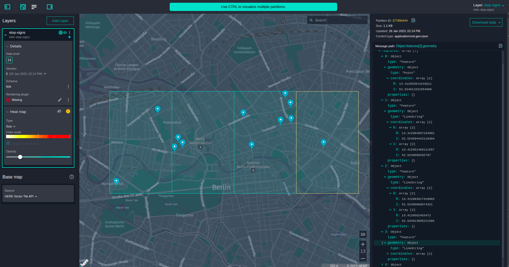

# Infer Stop Signs From Sensors

This document contains the instructions to run the
`Infer Stop Signs From Sensors` example.

The example shows how to use the distributed clustering and path matching
algorithms of the `Location Library` together with the
`HERE Optimized Map for Location Library` to derive the positions of stop signs.

Input data in form of the Sensor Data Ingestion Interface (SDII) format messages
are coming from a specified SDII index catalog.

The example logic does the following:

1. Retrieve stop sign events from the input catalog.

   - The example limits itself in the specified area of interest so that it does
     not process the entire world.
   - The input catalog contains various events, so it filters out all the events
     except stop sign events.
   - Any given stop sign event does not contain an event position but a time
     stamp when it happened and a path that the car drove along at that time.
     The example calculates the event position by applying interpolation logic.

2. Project stop sign event positions onto the closest road segment.

   - The example map-matches an event path for the stop sign, and then projects
     the event position of the stop sign onto the closest vertex of the matched
     path.

3. Cluster stops sign events.

   - The example uses interpolated stop sign event positions to cluster stop
     sign events.

4. Find the most probable position of the stop sign for each cluster

   - The example averages fraction values of projected points.

5. Publish the result into the output catalog.
   - The example uses the `Data Client Library` API to publish the result in the
     output catalog.

## Prerequisites

Before you execute the instructions in the next sections of this document, read
the [Prerequisites](../../../README.md#prerequisites) for the `Location Library`
examples.

To run the example, you need access to the following catalogs:

- [`HERE Optimized Map for Location Library`](https://platform.here.com/data/hrn:here:data::olp-here:here-optimized-map-for-location-library-2)
- [`HERE Sample SDII Messages - Berlin`](https://platform.here.com/data/hrn:here:data::olp-here:olp-sdii-sample-berlin-2)

## Get Your Credentials

To run this example, you need two sets of credentials:

- **Platform credentials:** To get access to platform data and resources, including HERE Map Content data for your
  pipeline input.
- **Repository credentials:** To download HERE Data SDK for Java & Scala libraries and Maven archetypes to your
  environment.

For more details on how to set up your credentials,
see [Identity & Access Management Developer Guide](https://developer.here.com/documentation/identity-access-management/dev_guide/index.html).

For more details on how to verify that your platform credentials are configured correctly, see
the [Verify Your Credentials](https://developer.here.com/documentation/java-scala-dev/dev_guide/verify-credentials/index.html)
tutorial.

## Build and Run the Compiler

In the commands that follow, replace the variable placeholders with the following values:

- `$PROJECT_HRN` is your project's `HRN` (returned by the `olp project create` command).
- `$COVERAGE` is a two-letter code for country and region (in this case, `DE` for Germany)
- `$INPUT_SDII_CATALOG` is the HRN of the public _sdii-catalog_ catalog in your pipeline
  configuration ([HERE environment](./config/here/local-pipeline-config.conf).
- `$INPUT_OPTIMIZED_MAP_CATALOG` is the HRN of the public _optimized-map-catalog_ catalog in your pipeline
  configuration ([HERE environment](./config/here/local-pipeline-config.conf).

> Note:
> We recommend that you set values to variables, so that you can easily copy and execute the following commands.

### Run the Application Locally

#### Create a Local Output Catalog

The catalog you need to create is used to store the results of the `Infer Stop Signs From Sensors` example.

To run this compiler locally, use a local output catalog as described
below. For more information about local catalogs, see
[the SDK tutorial about local development and testing](https://developer.here.com/documentation/java-scala-dev/dev_guide/local-development-workflow/index.html)
and [the OLP CLI documentation](https://developer.here.com/documentation/open-location-platform-cli/user_guide/topics/local-data-workflows.html).

1. Use
   the [`olp local catalog create`](https://developer.here.com/documentation/open-location-platform-cli/user_guide/topics/local-data/catalog-commands.html#catalog-create)
   command to create a local catalog.

```bash
olp local catalog create infer-stop-signs infer-stop-signs --summary "Output catalog for Infer Stop Signs From Sensors example" \
            --description "Output catalog for Infer Stop Signs From Sensors example"
```

The local catalog will have the HRN `hrn:local:data:::infer-stop-signs`.

2. Use
   the [`olp local catalog layer add`](https://developer.here.com/documentation/open-location-platform-cli/user_guide/topics/local-data/layer-commands.html#catalog-layer-add)
   command to add one `versioned` layer to your catalog:

```bash
olp local catalog layer add hrn:local:data:::infer-stop-signs stop-signs stop-signs --versioned --summary "Layer for output partitions" \
            --description "Layer for output partitions" --content-type=application/vnd.geo+json \
            --partitioning=heretile:14 --coverage $COVERAGE
```

#### Run the Application from the Command Line

First, we're going to run the example using a
[Spark local environment](https://spark.apache.org/docs/latest/),
suitable for local development and debugging.

1. Compile and execute the example.

For the HERE platform environment:

```bash
sbt run \
     -Dpipeline-config.file=config/here/local-pipeline-config.conf \
     -Dpipeline-job.file=config/here/pipeline-job.conf \
     -Dspark.master=local[2]
```

In the command above:

- `local-pipeline-config.conf` defines the `HRN`s of the input and output catalogs.
- `pipeline-job.conf` defines the versions of the input and output catalogs.
- `local[2]` defines the number of threads Spark will run in parallel to
  process the batch.

After one run, in the HERE platform environment you can inspect the local catalog with the OLP CLI:

```
olp local catalog inspect hrn:local:data:::infer-stop-signs
```

You should see the following result with stop signs visualized:



### Run this Application as a HERE Platform Pipeline

#### Configure a Project

To follow this example, you will need
a [project](https://developer.here.com/documentation/identity-access-management/dev_guide/topics/manage-projects.html).
A project is a collection of platform resources
(catalogs, pipelines, and schemas) with controlled access. You can create a project through the
[HERE platform portal](https://platform.here.com/).

Alternatively, use the OLP
CLI [`olp project create`](https://developer.here.com/documentation/open-location-platform-cli/user_guide/topics/project/project-commands.html#create-project)
command to create the project:

```bash
olp project create $PROJECT_ID $PROJECT_NAME
```

The command returns
the [HERE Resource Name (HRN)](https://developer.here.com/documentation/data-user-guide/user_guide/index.html) of your
new project. Note down this HRN as you will need it later in this tutorial.

> #### Note
>
> You do not have to provide a `--scope` parameter if your app has a default scope.
> For details on how to set a default project scope for an app, see the _Specify a
> default Project_ for Apps chapter of
> the [Identity & Access Management Developer Guide](https://developer.here.com/documentation/identity-access-management/dev_guide/index.html).

For more information on how to work with projects, see
the [Organize your work in projects](https://developer.here.com/documentation/java-scala-dev/dev_guide/organize-work-in-projects/index.html)
tutorial.

#### Create an Output Catalog

The catalog you need to create is used to store the results of the `Infer Stop Signs From Sensors` example.

Use the [HERE platform portal](https://platform.here.com/)
to [create the output catalog](https://developer.here.com/documentation/data-user-guide/user_guide/portal/catalog-creating.html)
in your project
and [add the following layers](https://developer.here.com/documentation/data-user-guide/user_guide/portal/layer-creating.html):

| Layer ID   | Layer Type | Content Type             | Partitioning | Zoom Level | Content Encoding | Coverage |
| ---------- | ---------- | ------------------------ | ------------ | ---------- | ---------------- | -------- |
| stop-signs | versioned  | application/vnd.geo+json | heretile     | 14         | uncompressed     | DE       |

Alternatively, you can use the OLP CLI to create the catalog and the corresponding layers.

1. Use
   the [`olp catalog create`](https://developer.here.com/documentation/open-location-platform-cli/user_guide/topics/data/catalog-commands.html#catalog-create)
   command to create the catalog.
   Make sure to note down the HRN returned by the following command for later use:

```bash
olp catalog create $CATALOG_ID $CATALOG_ID --summary "Output catalog for Infer Stop Signs From Sensors example" \
            --description "Output catalog for Infer Stop Signs From Sensors example" \
            --scope $PROJECT_HRN
```

2. Use
   the [`olp catalog layer add`](https://developer.here.com/documentation/open-location-platform-cli/user_guide/topics/data/layer-commands.html#catalog-layer-add)
   command to add two versioned layers to your catalog:

```bash
olp catalog layer add $CATALOG_HRN stop-signs stop-signs --versioned --summary "Layer for output partitions" \
            --description "Layer for output partitions" --content-type=application/vnd.geo+json \
            --partitioning=heretile:14 --coverage $COVERAGE \
            --scope $PROJECT_HRN
```

> #### Note::
>
> If a billing tag is required in your realm, use the `--billing-tags: "YOUR_BILLING_TAG"` parameter.

3. Update the output catalog HRN in the pipeline-config.conf file

The `config/here/pipeline-config.conf` (for the HERE platform environment) file contains
the permanent configuration of the data sources for the example.

Pick the file that corresponds to your platform environment and replace `YOUR_OUTPUT_CATALOG_HRN` placeholder
with the HRN of your Stream Path Matcher catalog.
To find the HRN, in the [HERE platform portal](https://platform.here.com/), navigate to your catalog. The HRN is
displayed in the upper
left corner of the page.

4. Use
   the [`olp project resource link`](https://developer.here.com/documentation/open-location-platform-cli/user_guide/topics/project/project-link-commands.html#project-resource-link)
   command to link the _HERE Sample SDII Messages - Berlin_ and _HERE Optimized Map for Location Library_ catalog to
   your project.

```bash
olp project resource link $PROJECT_HRN $INPUT_SDII_CATALOG
olp project resource link $PROJECT_HRN $INPUT_OPTIMIZED_MAP_CATALOG
```

- For more details on catalog commands,
  see [Catalog Commands](https://developer.here.com/documentation/open-location-platform-cli/user_guide/topics/data/catalog-commands.html).
- For more details on layer commands,
  see [Layer Commands](https://developer.here.com/documentation/open-location-platform-cli/user_guide/topics/data/layer-commands.html).
- For more details on project commands,
  see [Project Commands](https://developer.here.com/documentation/open-location-platform-cli/user_guide/topics/project/project-commands.html).
- For instructions on how to link a resource to a project,
  see [Project Resource Link command](https://developer.here.com/documentation/open-location-platform-cli/user_guide/topics/project/project-link-commands.html#project-resource-link).

#### Generate a Fat JAR file

Generate a "fat jar" that contains all the dependencies along with the example

```bash
sbt assembly
```

#### Deploy Fat JAR to a Pipeline

You can use the OLP CLI to create pipeline components and activate the pipeline version with the following commands:

1. [Create](https://developer.here.com/documentation/open-location-platform-cli/user_guide/topics/pipeline-workflows.html)
   pipeline components:

```bash
olp pipeline create $COMPONENT_NAME_Pipeline --scope $PROJECT_HRN
olp pipeline template create $COMPONENT_NAME_Template batch-4.0 $PATH_TO_JAR \
                com.here.platform.example.location.scala.spark.InferStopSignsFromSensorsExample \
                --input-catalog-ids="$PATH_TO_CONFIG_FOLDER/pipeline-config.conf" \
                --scope $PROJECT_HRN
olp pipeline version create $COMPONENT_NAME_version $PIPELINE_ID $PIPELINE_TEMPLATE_ID \
                "$PATH_TO_CONFIG_FOLDER/pipeline-config.conf" \
                --scope $PROJECT_HRN
```

- Make sure logs are produced with info level

```bash
olp pipeline version log level set $PIPELINE_ID $PIPELINE_VERSION_ID \
--log4j-properties="$PATH_TO_PROJECT/src/main/resources/log4j.properties" \
--scope $PROJECT_HRN
```

If the operation is successful, you should be able to see the log level you just set:

```sh
olp pipeline version log level get $PIPELINE_ID $PIPELINE_VERSION_ID --scope $PROJECT_HRN
```

2. [Activate](https://developer.here.com/documentation/open-location-platform-cli/user_guide/topics/pipeline/version-commands.html#pipeline-version-activate)
   the pipeline version:

```bash
olp pipeline version activate $PIPELINE_ID $PIPELINE_VERSION_ID --input-catalogs "$PATH_TO_CONFIG_FOLDER/pipeline-job.conf" --scope $PROJECT_HRN
```

#### Inspect the Output Catalog

- Wait until the pipeline version terminates

This allows to wait until the internal job reaches the `completed` state, with a timeout of 30 minutes:

```bash
olp pipeline version wait $PIPELINE_ID $PIPELINE_VERSION_ID --job-state=completed --timeout=1800 --scope $PROJECT_HRN
```

- Inspect the partitions

By zooming in the **Inspect** tab, you may see the position of stop signs inferred from sensor data:


You may fetch those partitions locally:

```bash
olp catalog layer partition get $CATALOG_HRN stop-signs --all --output="$PATH_TO_PROJECT/target/stop-signs" --scope $PROJECT_HRN
```
